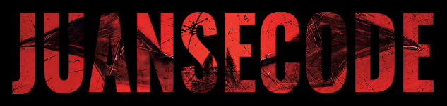

<!-- About Me -->
<h1 align="center">
  
</h1>
Hello there! I'm Juan Sebastian, a Junior FullStack Web and a Software Engineer in training. Enthusiastic about living new experiences in companies within the sector. Motivated to continuously learn from colleagues and the challenges they present. Highly interested in the areas of architecture and development, aiming for high-quality software with minimal cost for clients.

<!-- Knowlege -->
## 📚 Knowledge
In the following sections, you'll find an overview of my technical skills and team management abilities, providing insights into my expertise in software development and technology.

    <h3 align="center">Technical Skills</h3>
    
    
    
    
    
    
    
    
    
    
    

    <h3 align="center">Team Management</h3>
    
    
    

<!-- Github Stats -->
## &#x1f4c8; GitHub Stats

    <!-- Taked from: https://github.com/anuraghazra/github-readme-stats#readme -->
        
        

<!-- Personal Life -->
## 👾 My lifestyle
I'm someone deeply fond of anime and the captivating worlds it offers. Alongside my passion for anime, I'm also an avid enthusiast of superheroes, drawn to their larger-than-life adventures, moral dilemmas, and the timeless battle between good and evil. When I'm not indulging in the captivating narratives of anime and superhero lore, you'll often find me immersed in the immersive realms of video games, where I embark on epic quests, test my strategic prowess, and revel in the thrill of the virtual exploration. Here, you'll find the last song I listened to on Spotify 🎶.

  

<!-- Contact -->
## ✉ Contact Me

    
    
    

  

